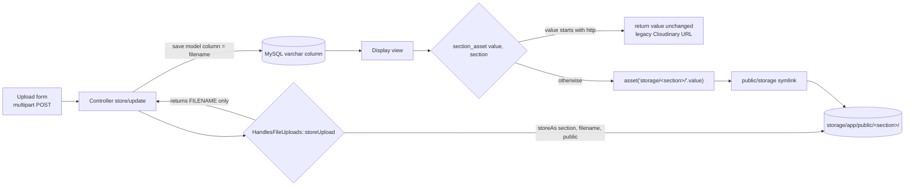

# Design Document: Local File Storage

## Overview

This feature replaces Cloudinary-based uploads with local storage on Laravel's `public`
disk (`storage/app/public`). New uploads are written to one folder per content Section
(folder name equals the Section name, e.g. `community_board`), the database stores the
**filename only**, and display views build URLs from the `public/storage` symlink. Existing
records that hold Cloudinary URLs (values starting with `http`) continue to render unchanged,
with no data migration.

The change touches nine controllers (Community, Blog, Meganews, MegaTrivia, Megagram,
MegaGoodVibes, PhotoGallery, CorporateOffice, HumanResource) and the Blade views that render
their files. Two small building blocks centralize the behavior:

1. A controller trait `App\Http\Controllers\Concerns\HandlesFileUploads` that stores an
   uploaded file and returns its filename.
2. A global helper `section_asset()` that turns a stored value into a URL, passing legacy
   `http` values through untouched.

No database migrations are required — the same `varchar` columns now hold a filename instead
of a URL.

### Research summary

- **`storeAs` on the `public` disk auto-creates folders.** `UploadedFile::storeAs($dir, $name, 'public')`
  writes under `storage/app/public/$dir` and creates the directory tree if missing
  ([Laravel filesystem docs](https://laravel.com/docs/9.x/filesystem#storing-files)). This
  satisfies "create the Section_Folder before writing" without explicit `mkdir`.
- **`asset('storage/...')` + `storage:link`.** The `public` disk's public URL is served through
  the `public/storage` symlink created by `php artisan storage:link`
  ([Laravel filesystem docs](https://laravel.com/docs/9.x/filesystem#the-public-disk)). This is
  the display contract in Requirement 5.
- **`composer.json` already links storage.** The existing `post-install-cmd` runs
  `ln -sr storage/app/public public/storage`, so the symlink is created on install. The design
  still calls out verifying/creating it because the link is not tracked in git and may be absent
  in a given checkout.
- **Global helpers via composer `files` autoload.** Adding `app/helpers.php` to the composer
  `autoload.files` array and running `composer dump-autoload` loads the helper on every request
  ([Composer autoload docs](https://getcomposer.org/doc/04-schema.md#files)). Laravel itself uses
  this pattern.
- **`Storage::fake('public')`** swaps the disk for an in-memory fake in tests, so feature tests
  can assert a file exists at a given path without touching the real filesystem
  ([Laravel testing docs](https://laravel.com/docs/9.x/mocking#storage-fake)).

> Content was rephrased for compliance with licensing restrictions.

## Architecture

### Data flow



The upload path (form → controller → trait → public disk + DB filename) and the display path
(DB filename → view → helper → symlink → file) are symmetric. The trait owns "how a file is
stored and named"; the helper owns "how a stored value becomes a URL". Legacy Cloudinary URLs
only affect the display path (the helper's `http` branch); the upload path always produces
filenames.

### Storage layout

```
storage/app/public/
  community_board/         <- Community image or video
  blogs/                   <- Blog images (multi)
  meganews/                <- Meganews images (multi)
  megatrivia/              <- MegaTrivia image
  megagram/                <- Megagram image
  megagoodvibes/           <- MegaGoodVibes thumbnail (root)
    videos/                <- MegaGoodVibes video (subfolder)
  photo_gallery/           <- PhotoGallery images (multi)
  corporate_office/        <- CorporateOffice organizational_structure
  human_resources/         <- HR single/image-or-video uploads
  announcements/           <- HR announcement image loops
```

`public/storage` (symlink) → `storage/app/public`, so a stored filename `x.jpg` under
`community_board` is served at `/storage/community_board/x.jpg`.

## Components and Interfaces

### 1. Trait: `App\Http\Controllers\Concerns\HandlesFileUploads`

A trait is chosen over a service class because every upload site is already a controller
method, the operation is stateless, and a trait lets each controller call `$this->storeUpload(...)`
with zero constructor wiring or dependency injection. This is the minimal footprint for a
codebase with no existing service layer. (A `FileStorageService` would add a class, a binding,
and constructor injection to nine controllers for no behavioral gain — see Design Decisions.)

```php
namespace App\Http\Controllers\Concerns;

use Illuminate\Http\UploadedFile;
use Illuminate\Support\Str;

trait HandlesFileUploads
{
    /**
     * Store an uploaded file on the public disk under <section>[/<subfolder>]
     * and return the FILENAME ONLY (no path, no URL).
     */
    protected function storeUpload(UploadedFile $file, string $section, ?string $subfolder = null): string
    {
        $ext = $file->getClientOriginalExtension() ?: $file->guessExtension() ?: 'bin';
        $filename = time().'_'.Str::random(8).'.'.$ext;

        $dir = $section.($subfolder ? '/'.$subfolder : '');
        $file->storeAs($dir, $filename, 'public'); // auto-creates the folder

        return $filename; // filename only — Requirement 2
    }
}
```

Interface contract:

| Method | Input | Output | Notes |
|--------|-------|--------|-------|
| `storeUpload(UploadedFile $file, string $section, ?string $subfolder = null)` | uploaded file, section name, optional subfolder | `string` filename only | writes to `public` disk; folder auto-created; unique name via `time().'_'.Str::random(8)`; extension from client, falling back to `guessExtension()` then `bin` |

Design note: video vs image use the **same** store mechanism. There is no separate
`uploadVideo` on local storage — `storeAs` does not care about MIME type. MegaGoodVibes video
uses `subfolder = 'videos'`; everything else omits the subfolder.

### 2. Helper: `section_asset()` in `app/helpers.php`

```php
if (! function_exists('section_asset')) {
    /**
     * Build a display URL for a stored file reference.
     * - empty  -> '' (view decides on a default/placeholder)
     * - http*  -> returned unchanged (legacy Cloudinary URL)
     * - else   -> asset('storage/<section>[/<subfolder>]/<filename>')
     */
    function section_asset(?string $value, string $section, ?string $subfolder = null): string
    {
        if (empty($value)) {
            return '';
        }
        if (str_starts_with($value, 'http')) {
            return $value;
        }
        $path = 'storage/'.$section.($subfolder ? '/'.$subfolder : '').'/'.$value;
        return asset($path);
    }
}
```

Autoload wiring (composer.json):

```json
"autoload": {
    "psr-4": { "App\\": "app/", "Database\\Factories\\": "database/factories/", "Database\\Seeders\\": "database/seeders/" },
    "files": [ "app/helpers.php" ]
}
```

After editing `composer.json`, `composer dump-autoload` must be run so the helper is registered
in the autoloader. `str_starts_with` is available on PHP 8; on PHP 7.4 targets the
`laravel/helpers`/`symfony/polyfill` already in the dependency tree provides it, but the design
uses `Str::startsWith($value, 'http')` as a portable equivalent if a 7.4 runtime is in play.

> Chosen approach: global helper via composer `files`. A Blade directive `@sectionAsset` is a
> valid alternative but only works inside Blade; the helper also works in controllers/tests,
> which the property tests need. See Design Decisions.

### 3. Storage symlink

`php artisan storage:link` must have created `public/storage`. The design requires a setup step
to verify the link exists and create it if missing. This is operational (not code) and is already
wired into `composer.json`'s `post-install-cmd`.

### 4. Per-controller changes

Every `cloudinary()->upload(...)` / `cloudinary()->uploadVideo(...)` call is replaced by
`$this->storeUpload(...)`. Each controller adds `use HandlesFileUploads;`. The table below maps
each site (before → after). Post-save redirects and all non-file fields are unchanged
(Requirement 8).

| Controller::method | Field | Section (subfolder) | Shape | Before | After |
|---|---|---|---|---|---|
| `CommunityController::store` | `image` | `community_board` | single (image **or** video) | mime branch: `uploadVideo` for `video/mp4`, else `upload`; else `''` | `$request->hasFile('image') ? $this->storeUpload($request->file('image'), 'community_board') : ''` — one call handles both types |
| `BlogController::store` | `image[]` | `blogs` | multi | `foreach(request()->image)` → `cloudinary()->upload(...)` per Blog_Images | `foreach` → `$this->storeUpload($imageData, 'blogs')` per Blog_Images |
| `MeganewsController::store` | `image[]` | `meganews` | multi | `foreach` → `upload` per Meganews_Image | `foreach` → `$this->storeUpload($image, 'meganews')` per Meganews_Image |
| `MeganewsController::update` | `image[]` | `meganews` | multi (replace all when present) | on `hasFile`: delete old images, `foreach` → `upload` | on `hasFile`: delete old images, `foreach` → `$this->storeUpload($image, 'meganews')` |
| `MegaTriviaController::store` | `image` | `megatrivia` | single (required) | `upload` unconditionally | `$this->storeUpload($request->file('image'), 'megatrivia')` |
| `MegaTriviaController::update` | `image` | `megatrivia` | single (replace only if present) | `if($request->file('image'))` → `upload` | `if($request->file('image'))` → `$this->storeUpload(..., 'megatrivia')` |
| `MegagramController::store` | `image` | `megagram` | single | `upload` unconditionally | `$this->storeUpload($request->file('image'), 'megagram')` |
| `MegagramController::update` | `image` | `megagram` | single (replace only if present) | `if($request->file('image'))` → `upload` | `if($request->file('image'))` → `$this->storeUpload(..., 'megagram')` |
| `MegaGoodVibesController::store` | `file` (video) | `megagoodvibes/videos` | single video | `hasFile('file')` → `uploadVideo(..., ['folder'=>'videos'])`, else `''` | `hasFile('file') ? $this->storeUpload($request->file('file'), 'megagoodvibes', 'videos') : ''` |
| `MegaGoodVibesController::store` | `thumbnail` | `megagoodvibes` | single image | **unconditional** `cloudinary()->upload($request->file('thumbnail')...)` | preserve unconditional intent but make null-safe: `$this->storeUpload($request->file('thumbnail'), 'megagoodvibes')` **guarded** so a missing thumbnail yields `''` instead of a fatal null call — see nuance below |
| `MegaGoodVibesController::update` | `file` | `megagoodvibes/videos` | single (replace if present) | `if(hasFile('file'))` → `uploadVideo(folder videos)` | `if(hasFile('file'))` → `$this->storeUpload(..., 'megagoodvibes', 'videos')` |
| `MegaGoodVibesController::update` | `thumbnail` | `megagoodvibes` | single (replace if present) | `if(hasFile('thumbnail'))` → `upload` | `if(hasFile('thumbnail'))` → `$this->storeUpload(..., 'megagoodvibes')` |
| `PhotoGalleryController::store` | `image[]` | `photo_gallery` | multi | `foreach` → `upload` per Photo_Gallery | `foreach` → `$this->storeUpload($image, 'photo_gallery')` per Photo_Gallery |
| `CorporateOfficeController::store` | `organizational_structure` | `corporate_office` | single | `hasFile` → `upload`, else `''` | `hasFile ? $this->storeUpload($request->file('organizational_structure'), 'corporate_office') : ''` |
| `CorporateOfficeController::update` | `organizational_structure` | `corporate_office` | single (replace only if present) | `if(hasFile)` → `upload`, sets column | `if(hasFile)` → `$this->storeUpload(...)`, sets column; column untouched otherwise |
| `HumanResourceController::storeNewHire` | `image` | `human_resources` | single | `hasFile('image')` → `upload`, else `''` | `hasFile ? $this->storeUpload($request->file('image'), 'human_resources') : ''` |
| `HumanResourceController::storeNewJob` | `image` | `human_resources` | single | `hasFile('image')` → `upload`, else `''` | `hasFile ? $this->storeUpload($request->file('image'), 'human_resources') : ''` |
| `HumanResourceController::storeHrWebsite` | `image` | `human_resources` | single (image **or** video via mime branch) | mime branch: `uploadVideo` for `video/mp4` else `upload`; else `''` | `hasFile ? $this->storeUpload($request->file('image'), 'human_resources') : ''` — one call handles both types |
| `HumanResourceController::store` | `image[]` | `announcements` | multi | `hasFile` → `foreach` → `upload` per Announcements_Images | `foreach` → `$this->storeUpload($image, 'announcements')` per Announcements_Images |
| `HumanResourceController::update` | `image[]` | `announcements` | multi (delete-then-replace when present) | deletes old images, `foreach` → `upload` per Announcements_Images | deletes old images, `foreach` → `$this->storeUpload($image, 'announcements')` |

HumanResource has **five** upload sites, enumerated above: `storeNewHire`, `storeNewJob`, and
`storeHrWebsite` (single, to `human_resources`), plus `store` and `update` (multi, to
`announcements`). `storeHrWebsite` is the image-or-video mime branch.

**MegaGoodVibes thumbnail nuance.** The current `store` uploads the thumbnail unconditionally
(no `hasFile` guard), which would fatal if no thumbnail were posted. The redesign preserves the
"thumbnail is expected on create" behavior but makes it null-safe: if `$request->file('thumbnail')`
is present, store it; otherwise save `''`. This keeps normal submissions identical while removing
the latent null-deref, and is called out explicitly so reviewers can confirm the intent.

### 5. View / display changes

Views that currently render a stored value directly (e.g. `{{$communityData->image}}`,
`{{$imageData->image}}`) or via `asset('img/<section>/'.$image)` switch to
`section_asset($value, '<section>')`. Because the helper passes `http` values through, legacy
Cloudinary URLs keep working; because it builds `storage/<section>/...` otherwise, new filenames
resolve through the symlink.

Concrete views confirmed during discovery (non-exhaustive — a grep step is mandatory, see below):

- `resources/views/pages/community_board_page.blade.php` — background-image and `<video>` `src`
  on `$communityData->image`; keep the `stripos($communityData->image, 'mp4')` branch on the
  **raw stored value**, and feed `section_asset($communityData->image, 'community_board')` into
  the `src`/`url(...)`.
- `resources/views/new_main/pages/community-board.blade.php` and `main.blade.php` community_board
  and blogs `img` sites.
- `resources/views/pages/kamegawide_blogs.blade.php` and blog-details views (blog images).
- `resources/views/new_main/pages/meganewsDetails.blade.php` (`{{$imageData->image}}`).
- `resources/views/pages/view_hr_website_lists.blade.php` — echoes raw `$hrWebsiteData->image`
  including mp4 detection: keep `stripos(...,'mp4')` on the raw value, wrap the URL with
  `section_asset($hrWebsiteData->image, 'human_resources')`.
- `resources/views/pages/did_you_know.blade.php` — mp4 detection on the raw value; same pattern.
- Photo gallery, MegaTrivia, Megagram, MegaGoodVibes (thumbnail root + `videos` subfolder for the
  `file`), and Corporate Office (`organizational_structure`) display views.

**Video URL + mp4 detection rule.** The existing `stripos($value, 'mp4')` checks decide whether to
render `<video>` vs ``/background. Keep those checks on the **raw stored value** (a filename
like `123_ab.mp4` still contains `mp4`; a Cloudinary URL ending `.mp4` still contains `mp4`).
Only the URL that feeds `src`/`url(...)` is produced by `section_asset(...)`. For MegaGoodVibes
video, pass the `videos` subfolder: `section_asset($item->file, 'megagoodvibes', 'videos')`.

**Legacy `img/<section>` caveat.** Some views used the old local convention
`asset('img/<section>/'.$value)`. That scheme predates Cloudinary and those columns may now hold
Cloudinary URLs. Routing every such site through `section_asset` centralizes the decision: `http`
values pass through and filenames resolve under `storage/<section>/`. Wrapping these sites needs
care to not double-prefix — the helper takes the **raw** stored value, not a pre-built `img/...`
string.

**Mandatory discovery step.** Before editing views, grep each stored column across Blade so no
display site is missed:

```
grep -rn "->image\|->thumbnail\|->file\|organizational_structure" resources/views
grep -rn "asset('img/" resources/views
```

Map each hit to its Section and wrap with `section_asset(...)`. This discovery is part of the
design deliverable so the display change is complete, not just the sites listed above.

## Data Models

No schema changes and no migration. The columns keep their existing `varchar` type; only the
**meaning** of the value changes from "full URL" to "filename" for new rows. Legacy rows keep
their URL values.

| Model | Table | Column(s) | Section | Before value | After value (new rows) |
|---|---|---|---|---|---|
| `Community_Board` | community_board | `image` | community_board | Cloudinary URL | filename (image or video) |
| `Blog_Images` | blog_images | `image` | blogs | Cloudinary URL | filename |
| `Meganews_Image` | meganews_image | `image` | meganews | Cloudinary URL | filename |
| `MegaTrivia` | megatrivia | `image` | megatrivia | Cloudinary URL | filename |
| `Megagram` | megagram | `image` | megagram | Cloudinary URL | filename |
| `MegaGoodVibes` | megagoodvibes | `file`, `thumbnail` | megagoodvibes(/videos) | Cloudinary URL | filenames (`file` under `videos`) |
| `Photo_Gallery` | photo_gallery | `image` | photo_gallery | Cloudinary URL | filename |
| `Corporate_Office` | corporate_office | `organizational_structure` | corporate_office | Cloudinary URL | filename |
| `New_Hires`, `Job_Vacancies`, `Hr_Website` | (respective) | `image` | human_resources | Cloudinary URL | filename |
| `Announcements_Images` | announcements_images | `image` | announcements | Cloudinary URL | filename |

The `videos` subfolder for MegaGoodVibes is a storage-path detail, not a DB detail: the DB still
stores just the filename; the `videos` segment is reintroduced at display time by
`section_asset($file, 'megagoodvibes', 'videos')`.

## Correctness Properties

*A property is a characteristic or behavior that should hold true across all valid executions of
a system — essentially, a formal statement about what the system should do. Properties serve as
the bridge between human-readable specifications and machine-verifiable correctness guarantees.*

The pure, input-varying logic in this feature is the trait's filename/path construction and the
`section_asset()` helper. Those are the natural targets for property-based tests. Controller
wiring, redirects, auth, and the symlink are verified with example/integration/smoke tests
(see Testing Strategy). The prework consolidated the criteria into the seven properties below.

### Property 1: Uploads land under the section (and subfolder) path

*For all* uploaded files, section names, and optional subfolders, calling `storeUpload($file,
$section, $subfolder)` results in a file existing on the `public` disk at
`"$section" . ($subfolder ? "/$subfolder" : "") . "/" . <returnedFilename>`, even when that folder
did not previously exist.

**Validates: Requirements 1.1, 1.2, 1.3, 1.6**

### Property 2: Stored reference is a bare filename

*For all* uploaded files and sections, the value returned by `storeUpload` (the value saved to the
DB) contains no directory separator (`/` or `\`) and does not begin with `http`.

**Validates: Requirements 2.1, 2.2**

### Property 3: Generated filenames are unique within a section

*For all* sequences of uploads into the same section, the filenames returned by `storeUpload` are
pairwise distinct.

**Validates: Requirements 1.4**

### Property 4: Filenames render to the storage URL

*For all* non-empty file references that do not begin with `http`, and all sections and optional
subfolders, `section_asset($value, $section, $subfolder)` equals
`asset('storage/' . $section . ($subfolder ? "/$subfolder" : "") . '/' . $value)`.

**Validates: Requirements 5.1, 5.2, 6.2**

### Property 5: Legacy `http` values pass through unchanged

*For all* file reference values that begin with `http`, and all sections and subfolders,
`section_asset($value, $section, $subfolder)` returns the value unchanged (identity), leaving the
stored data untouched.

**Validates: Requirements 6.1, 6.3, 7.2**

### Property 6: Multi-image uploads preserve count

*For all* lists of uploaded images submitted to a multi-image handler (Blog, Meganews,
PhotoGallery, HumanResource announcements), the number of files stored in the section folder and
the number of image records created both equal the length of the submitted list.

**Validates: Requirements 3.2**

### Property 7: Update without a new file preserves the existing reference

*For all* existing file reference values (a filename or a legacy Cloudinary URL), processing an
Update_Handler submission that contains no new uploaded file for that field leaves the field's
stored value identical to its prior value.

**Validates: Requirements 4.2**

## Error Handling

| Condition | Handling |
|---|---|
| No file posted for a field (single) | Controller guard `$request->hasFile(...)` → save `''` (Requirement 3.5). `section_asset('', ...)` returns `''`, and the view renders its default/placeholder. |
| No file posted on update | Guard skips replacement; existing value retained (Property 7 / Requirement 4.2). |
| Missing/empty file extension | `storeUpload` falls back `getClientOriginalExtension() ?: guessExtension() ?: 'bin'`, so a filename is always valid. |
| Section folder absent | `storeAs` on the `public` disk auto-creates the directory tree (Requirement 1.3); no explicit `mkdir`. |
| Missing `public/storage` symlink | Files store correctly but 404 on display. Mitigation: setup step verifies/creates the symlink via `php artisan storage:link` (already in `composer.json` `post-install-cmd`). Documented in Testing Strategy as a smoke check. |
| MegaGoodVibes thumbnail missing on create | Made null-safe: guard so a missing thumbnail saves `''` instead of a fatal null call, preserving normal-submission behavior. |
| Legacy Cloudinary URL value | `section_asset` returns it unchanged (Property 5); no error, no migration. |

## Testing Strategy

Dual approach: property tests for the pure logic, example/integration/smoke tests for wiring,
redirects, auth, and setup.

### Property-based tests

- **Library:** No mature standalone PBT engine ships for PHPUnit here, so property tests are
  implemented as PHPUnit tests that generate randomized inputs with **`fakerphp/faker`** (already
  a dev dependency) inside a loop. Each property test runs **at least 100 iterations** and does
  **not** hand-roll a shrinking framework — it uses Faker generators plus `UploadedFile::fake()`.
- **Fake disk:** `Storage::fake('public')` for all storage-side properties, so assertions run
  in-memory and never touch the real filesystem or Cloudinary.
- Each property test is tagged with a comment referencing its design property, format:
  `// Feature: local-file-storage, Property {number}: {property_text}`.

Mapping of property → test:

| Property | Test outline (≥100 iterations) |
|---|---|
| P1 | Faker random section (and sometimes `videos` subfolder) + `UploadedFile::fake()->image()`/`->create('v.mp4')`; call `storeUpload`; assert `Storage::disk('public')->exists("$section[/videos]/$returned")`. |
| P2 | For each generated upload, assert `!str_contains($returned, '/')`, `!str_contains($returned, '\\')`, `!Str::startsWith($returned, 'http')`. |
| P3 | Store many files into one section; collect returned names; assert `count(array_unique($names)) === count($names)`. |
| P4 | Faker random non-empty filename (no `http` prefix) + random section/subfolder; assert `section_asset(...)` equals `asset('storage/'.$section.[...].'/'.$value)`. |
| P5 | Faker random URL prefixed `http`/`https`; assert `section_asset($url, $section, $subfolder) === $url` for random sections/subfolders. |
| P6 | Random N (e.g. 1–5) fake images posted to each multi-image route; assert stored file count == N and DB record count == N. |
| P7 | Seed a record with a random reference (filename or `http://...`); POST update with no file; assert column unchanged. |

### Example / unit tests (feature tests)

- One per single-image controller (Community, MegaTrivia, Megagram, CorporateOffice,
  HR `storeNewHire`/`storeNewJob`/`storeHrWebsite`): post `UploadedFile::fake()->image()`; assert
  the file lands in the correct named section folder and the column holds the filename
  (Requirements 1.5, 3.1).
- MegaGoodVibes store: post `UploadedFile::fake()->create('v.mp4', 1024, 'video/mp4')` as `file`
  and an image as `thumbnail`; assert `file` under `megagoodvibes/videos`, `thumbnail` under
  `megagoodvibes` (Requirement 3.4).
- Community / HR `storeHrWebsite` mp4: post a fake mp4; assert it lands in the section folder
  (Requirement 3.3).
- Empty-field: post without a file; assert column saved as `''` (Requirement 3.5).
- Update-with-file: assert the column becomes a new filename and the file is stored
  (Requirement 4.1).
- Non-file preservation: assert all other posted columns saved unchanged and the redirect target
  matches the pre-existing target per controller (Requirements 8.1, 8.2).

### Integration / smoke tests

- Affected routes still enforce `MsGraphAuthenticated` (Requirement 8.3) — 1–2 route tests.
- Smoke check that `public/storage` exists (or that `storage:link` is a documented setup step)
  (Requirement 5.3).
- Structural check: no `cloudinary()` call remains in the modified upload code paths
  (Requirement 7.1).

Property tests use `UploadedFile::fake()->image('x.jpg')` for images and
`UploadedFile::fake()->create('x.mp4', $kb, 'video/mp4')` for video.

## Requirements Mapping

| Requirement | Covered by |
|---|---|
| 1. Store per section on public disk | `HandlesFileUploads::storeUpload` (Components §1); Property 1; per-controller section mapping table (Components §4); folder auto-create (Error Handling) |
| 2. Persist filename only | `storeUpload` returns filename only (Components §1); Property 2; Data Models (columns unchanged) |
| 3. Single / multi / video shapes | Per-controller table (single, multi loops, mp4 branch collapse, MegaGoodVibes video+thumbnail) (Components §4); Property 6; example tests (3.1, 3.3, 3.4); empty-field guard (Error Handling, 3.5) |
| 4. Preserve files on update | Update rows in Components §4 (conditional replace); Property 7; update example tests |
| 5. Display via symlink | `section_asset` (Components §2); Property 4; symlink component (Components §3); view changes (Components §5) |
| 6. Backward compat with Cloudinary URLs | `section_asset` http-passthrough (Components §2); Property 5; raw-value mp4 detection retained (Components §5) |
| 7. Retire Cloudinary from upload paths | Per-controller before→after replaces `cloudinary()` calls (Components §4); structural no-`cloudinary()` check + `Storage::fake` tests; Property 5 keeps read compat |
| 8. Preserve non-upload behavior | Redirects/fields unchanged noted per row (Components §4); example tests for redirect + non-file columns; auth integration test (8.3) |

## Design Decisions and Rationale

- **Trait over service class.** Every upload site is a controller method and the operation is
  stateless. A trait (`HandlesFileUploads`) is called as `$this->storeUpload(...)` with no
  constructor wiring, container binding, or injection across nine controllers. A
  `FileStorageService` would add a class plus injection everywhere for no behavioral gain, in a
  codebase that has no existing service layer. Chosen for minimal footprint.
- **Filename-only vs full path.** Storing just the filename keeps references portable and
  independent of the disk root or host; the section and any subfolder are known at the call site
  (upload) and at render time (`section_asset(value, section[, subfolder])`), so they need not be
  duplicated in the DB. This also matches Requirement 2's explicit "filename only".
- **Backward-compat helper.** Centralizing the "is this a legacy URL or a new filename?" decision
  in one function (`str_starts_with($value, 'http')`) means no per-view conditionals and no data
  migration: legacy Cloudinary URLs pass through, new filenames resolve under the symlink.
- **Global helper (composer `files`) over Blade directive.** The helper must be callable from
  controllers and property tests, not only Blade, so a `files`-autoloaded function beats an
  `@sectionAsset` directive. Requires adding `app/helpers.php` to `autoload.files` and running
  `composer dump-autoload`.
- **No data migration.** Requirement explicitly keeps existing Cloudinary records as-is; the
  helper's passthrough makes migration unnecessary. Same `varchar` columns are reused — only the
  stored value's meaning changes for new rows.
- **Collapse the mp4 upload branch.** Local storage does not distinguish image vs video at write
  time, so the Community / HR `video/mp4` branch collapses to a single `storeUpload` call. mp4
  **display** detection stays on the raw stored value in the views, so `<video>` vs ``
  rendering is unaffected.

## Items to confirm

- **Filename scheme:** `time().'_'.Str::random(8).'.'.$ext` (opaque, collision-resistant) vs
  `$file->hashName()`. The design uses the former; confirm if you prefer `hashName()` or want the
  original client name preserved.
- **MegaGoodVibes thumbnail:** the redesign makes the currently-unconditional thumbnail upload
  null-safe (saves `''` if absent). Confirm this is acceptable (it removes a latent fatal without
  changing normal submissions).
- **Empty display default:** `section_asset` returns `''` for empty input and leaves the
  placeholder to the view. Confirm whether you want a shared default image instead.
